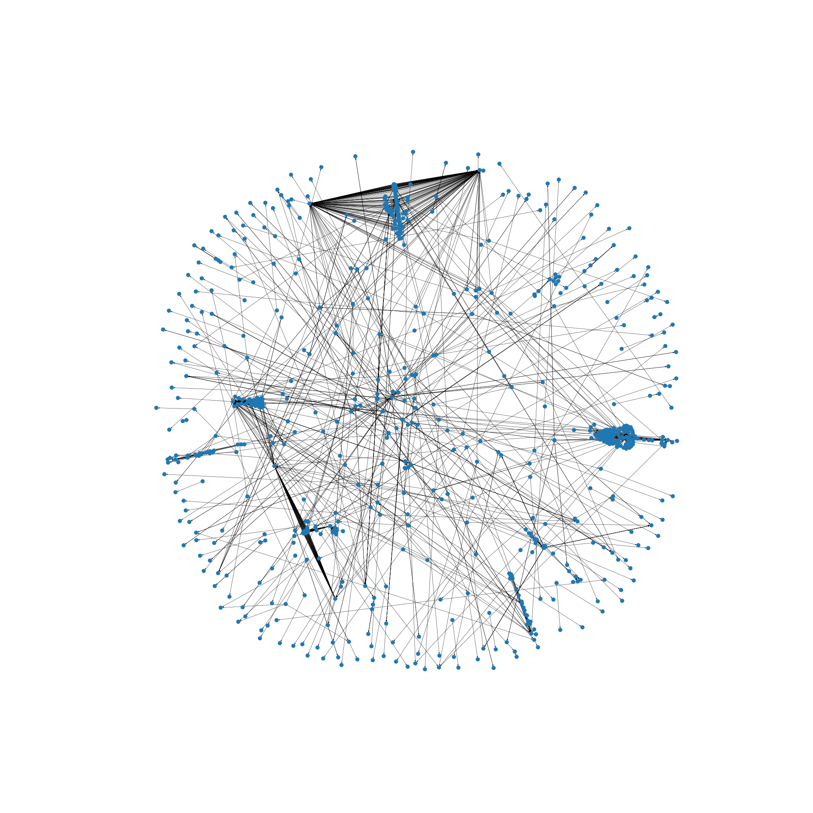

# Modeling user data on the TU Delft website
Modeling and Data Analysis in Complex Networks 2020

Kostas Chronas and Tim Bruyn



## Project synopsis

We have created a user model that simulates visitor behaviour on the TU Delft website.


We have done so by regarding the website as a directed graph with pages as nodes and hyperlinks as edges. Based on various nodal features we have assigned a probability to each node that the user will leave and a probability to each edge that the user will traverse it.

By running a user model on this probability graph, we have generated virtual user traffic that we have compared to actual user data. We have done so by creating a traffic graph with webpages as nodes, where two pages are connected if they have been visited by the same user. Each connection has a weight according to how often they are visited together. We have created these graphs for the virtual user traffic and for the actual user data and used various measures to compare them.

Based on the best model we have analysed the influence of all pages of the TU Delft website. For each page we have simulated 1000 extra visitors and ranked the pages according to how much extra traffic neighbouring pages received.

## Project structure

The project is structured as follows:

```
final
├── additional_output
│       Junk files generated while collecting data
├── crawlers_and_creators
│       Python files used to collect data and do initial processing
│        - Collect pages and hyperlinks from TU Delft website
│        - Generate hyperlink graph
│        - Generate subgraph (about 1000 nodes) from hyperlink graph (about 25000 nodes)
│        - Collect user data from SiteImprove
│        - Generate traffic graph from user data
│       WARNING: The code used to collect the data from SiteImprove will not work, 
│                because it relies on a SSH key that is not included in this repo
├── data
│       Json files with data
│        - User traffic
│        - Traffic graph
│        - Hyperlink graph
│        - Subgraph
├── documents
│       Markdown files with our project documents
│        - Final presentation
│        - Project planning
├── figures
│       Generated figures and tables
│        - Graph figures
│        - Model figures
│        - Metric plots
│        - Result tables
├── logs
│       Generated error logs
├── notebooks
│       Jupyter notebooks
├── pipeline
│   ├── entry_pages.json
│   ├── generated_user_traffic
│   │       Json files with generated user traffic
│   ├── infect
│   │       Python files that simulate the spreading process of users through the website
│   ├── probability_graphs
│   │       Python files to generate the probability graphs based on different metrics and the generated json files
│   │        - Random
│   │        - Pageviews
│   │        - Pagerank
│   │        - Degree
│   │        - Inverted degree
│   │        - Betweenness
│   │        - Inverted betweenness
│   │        - All metrics combined
│   ├── traffic_graphs
│   │       Json files with the traffic graphs
│   └── UserModel.py
│            A Python file that performs a random walk on a given probability graph
└── GraphLoader.py
        A Python file that saves and loads stored json files and returns a networkx graph
```
